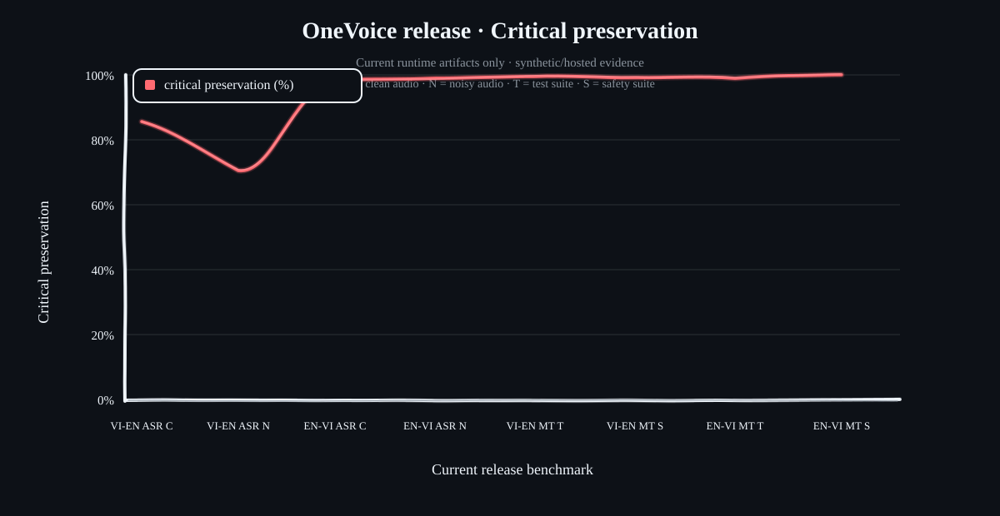
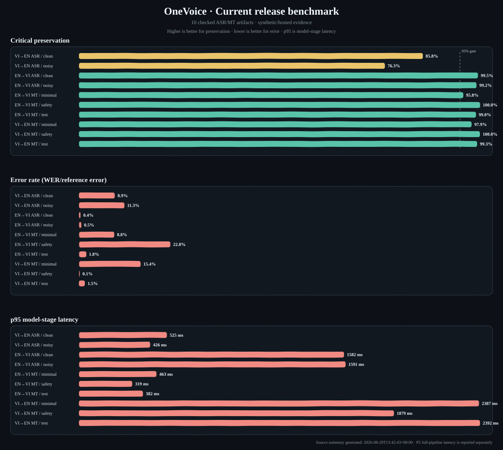

# OneVoice Edge V2 — Hệ Thống Phiên Dịch Giọng Nói Thời Gian Thực (Edge AI)


OneVoice là hệ thống dịch thuật Speech-to-Speech Việt ↔ Anh dành cho môi trường công nghiệp (nhà máy, công trường). Mục tiêu release hiện tại là **Windows PC offline desktop demo** để tái lập, demo và đưa vào hồ sơ dự án. Android/Snapdragon và tai nghe Bluetooth được giữ là roadmap tiếp theo. `edge_200mb` vẫn là mục tiêu portable/RAM thấp; desktop phải khai báo budget phần cứng riêng trong report P5. Dự án chưa tuyên bố production-ready khi chưa vượt dữ liệu thực địa.

---


## Trạng Thái OneVoice V2

V2 nâng cấp runtime từ mốc rollback `v1-working-baseline`. Bảng dưới đây phản ánh bằng chứng đã có, không đồng nghĩa với chứng nhận an toàn hay triển khai thực địa:

| Hạng mục | Trạng thái | Bằng chứng / giới hạn |
|---|---|---|
| Context Engine, thuật ngữ và Safety Matching | `ĐÃ KIỂM TRA` | Logic định tuyến xác định; safety WAV được duyệt nội bộ chỉ cho demo |
| Streaming 32 ms và semantic commit | `ĐÃ KIỂM TRA` | Fixed suite 4/4 và soak offline 30 phút, 325/325 lượt trên Colab; PC có P5 riêng |
| Denoising | `PASSTHROUGH ĐƯỢC CHỌN` | DeepFilterNet không cải thiện noisy dev và làm chậm pipeline; chưa promote |
| EN → VI ASR | `ĐẠT TRÊN TEST TỔNG HỢP` | SenseVoice FP32 ONNX; critical-term recall 99,17% trên PC noisy test |
| VI → EN ASR | `CÒN HẠN CHẾ` | GIPFormer ONNX baseline; critical-term recall 75,82% trên PC noisy test, dưới mục tiêu 95% |
| MT và TTS | `DÙNG ĐƯỢC CHO DEMO` | EnViT5 fine-tuned và TTS offline cục bộ; chưa khẳng định chất lượng giọng sản phẩm |
| Windows PC offline | `ĐÃ KIỂM TRA` | Hai bundle qua smoke không mạng; P5 qua budget desktop khai báo trên ASUS TUF F15 |
| Dữ liệu công trường thật | `CHƯA CÓ` | Chưa thu/đánh giá holdout WAV tại công trường; safety audio hiện có là dữ liệu tổng hợp cho demo |
| Android / Snapdragon / Bluetooth | `ROADMAP` | Chưa triển khai trên điện thoại |

Chi tiết bằng chứng: [V1 baseline](docs/V1_BASELINE_STATUS.md), [kế hoạch V1 → V2](ONEVOICE_V1_TO_V2_PLAN.md) và [hướng dẫn notebook V2](notebooks/README_V2.md).

---

## Bài Toán

OneVoice thử nghiệm dịch giọng nói Việt ↔ Anh cho hội thoại chuyên ngành công nghiệp. Bản desktop hiện hướng tới hoạt động offline sau khi cài đủ runtime và chép bundle mô hình/dữ liệu về máy. Đây là prototype nghiên cứu; chưa có dữ liệu hiện trường để kết luận độ bền vững trong tiếng ồn công trường và không thay thế quy trình an toàn lao động.

---

## Runtime Hiện Tại: Windows PC Offline Demo

### Luồng 1: VI → EN (Tiếng Việt → Tiếng Anh)

```text
Microphone
    │
    ▼
┌─────────────────────────────────┐
│  Trạm 0: Audio / streaming      │  Frame 32 ms + VAD
│  Passthrough denoiser           │  Không lọc nhiễu ở release hiện tại
└─────────────────────────────────┘
    │
    ▼
┌─────────────────────────────────┐
│  Trạm 1: Nhận diện tiếng Việt   │  GIPFormer ONNX baseline
│  Giọng nói → văn bản            │  Chưa đạt mục tiêu noisy critical-term
└─────────────────────────────────┘
    │
    ▼
┌─────────────────────────────────┐
│  Trạm 2: Dịch VI → EN           │  EnViT5 fine-tuned + context/validator
│  Kiểm tra thuật ngữ / nội dung  │  Có safety route riêng
└─────────────────────────────────┘
    │
    ▼
┌─────────────────────────────────┐
│  Trạm 3: Phát âm thanh          │  TTS hệ thống offline cho demo
│  Hoặc safety audio              │  WAV tổng hợp đã duyệt nội bộ
└─────────────────────────────────┘
    │
    ▼
Speaker / Earphone
```

### Luồng 2: EN → VI (Tiếng Anh → Tiếng Việt)

```text
Microphone
    │
    ▼
┌─────────────────────────────────┐
│  Trạm 0: Audio / streaming      │  Frame 32 ms + VAD
│  Passthrough denoiser           │  Không lọc nhiễu ở release hiện tại
└─────────────────────────────────┘
    │
    ▼
┌─────────────────────────────────┐
│  Trạm 1: Nhận diện tiếng Anh    │  SenseVoice FP32 ONNX
│  Giọng nói → văn bản            │  Không dùng Whisper trong release này
└─────────────────────────────────┘
    │ văn bản nhận dạng
    ▼
┌─────────────────────────────────┐
│  Trạm 2: Dịch EN → VI           │  EnViT5 fine-tuned + context/validator
│  Kiểm tra thuật ngữ / nội dung  │  Có safety route riêng
└─────────────────────────────────┘
    │ văn bản đã kiểm tra
    ▼
┌─────────────────────────────────┐
│  Trạm 3: Phát âm thanh          │  TTS hệ thống offline cho demo
│  Hoặc safety audio              │  WAV tổng hợp đã duyệt nội bộ
└─────────────────────────────────┘
    │
    ▼
Speaker / Earphone
```

**Mốc đo trên PC demo hiện tại:** ASUS TUF Gaming F15 (i5-11400H, RAM 24 GB, RTX 2050 4 GB VRAM), profile `desktop_tuf_f15_rtx2050`, budget 8 GB RSS và 3 giây commit→first-audio cho lượt thường. Đây là budget của laptop này, không phải kết quả cho mọi PC hay điện thoại. Profile portable `edge_200mb` là mục tiêu riêng và chưa đạt. Bản demo chưa được xác nhận cho vận hành công trường.

---


### Các lớp V2 bổ sung quanh hai luồng trên

```text
AudioFrame 32 ms
    → Denoiser
    → Stateful VAD + rolling utterance
    → Rolling ASR + stable prefix
    → Construction Context Engine
    → Semantic Commit (WAIT / NORMAL / SAFETY)
    → Safety Audio hoặc MT
    → Critical-field Validator
    → Ordered TTS
    → Audio đầu tiên + báo cáo latency
```

Hai sơ đồ VI→EN và EN→VI ở trên mô tả hướng model; chuỗi V2 này mô tả cơ chế streaming, an toàn và đo lường dùng chung cho cả hai hướng.

---

## Các Chế Độ Hoạt Động (Translation Directions)

Hệ thống là một đường ống hai chiều, cho phép chuyển đổi linh hoạt qua cờ lệnh runtime:

| Hướng (Direction) | Đầu vào (Người nói) | Đầu ra (Loa phát) | Lệnh chạy (Flag) |
|---|---|---|---|
| **VI → EN** (Mặc định) | Người Việt | Người Anh | `python src/pipeline.py --direction vi2en` |
| **EN → VI** | Người Anh | Người Việt | `python src/pipeline.py --direction en2vi` |

### Replay streaming (P2)

Để kiểm tra pipeline streaming với model thật mà không cần microphone, dùng `--stream-file`. WAV được chia thành frame 32 ms, tự thêm đuôi im lặng để xác nhận endpoint, tắt playback và ghi trace/latency vào `--report-dir`:

```bash
python src/pipeline.py --config config/config.yaml --direction vi2en --profile development --offline \
  --stream-file path/to/input.wav --report-dir reports/streaming_v2_smoke
```

Colab dùng `notebooks/colab_streaming_v2.ipynb`; notebook chỉ mount Drive và clone/pull GitHub, còn logic streaming nằm trong runtime Python. Kết quả `stream_result.json` ghi frame count, stable/unstable hypotheses, commit IDs, chunk timestamps, dropped frames và worker error (nếu có). Đây là integration smoke/soak gate, chưa phải tuyên bố production latency.

Cell cuối của notebook chạy `scripts/run_streaming_e2e.py`: fixed suite gồm normal + safety ở cả hai chiều, ghi `case_manifest.json`, report từng turn và `summary.json` có resume. Smoke mặc định dùng 1 case/route; chỉ tăng số case hoặc chạy soak sau khi smoke pass.

Sau fixed suite pass, dùng `scripts/run_streaming_soak.py --duration-minutes 30 --realtime --resume` để lặp fixed cases trong thời gian thực. `soak_state.json` tích luỹ thời lượng đã chạy, còn `events.jsonl` ghi từng turn nên có thể chuyển Colab account rồi chạy lại cùng output directory.

---

## Demo Kết Quả Dịch Thuật & Voice Cloning

Dưới đây là 7 kịch bản demo đã có từ baseline V1, gồm thuật ngữ chuyên ngành, từ lóng thi công và tình huống công trường. Đây là bằng chứng demo lịch sử, không thay thế benchmark V2 trên fixed test set. Các bản MP4 vẫn được lưu trong `demo_outputs/`:

1. **Test 1 (VI→EN)**
   - **Đầu vào**: Cậu đã làm gì với nó vậy thêm năng lượng hả nó hoạt động như thế nào vậy cho mình mượn chút đừng có keo kiệt vậy chứ hôm nay lớp mình có bài kiểm tra môn thể dục nên mình rất là cần nó luôn xài xong mình trả lại liền
   - **Bản dịch**: *What did you do with it? More power, huh? How it works. Well, let me borrow some. don't be mean, because we have a gym test today, so... I really need it. I'll give it back when I'm done.*
<details>
  <summary><h5>🔗 Nghe Audio</h5></summary>

[test_1_output_vi2en.webm](https://github.com/user-attachments/assets/274cef99-a640-4cc5-8ed6-2c7836ec417b)

[▶ Xem/nghe file MP4 trong repository](demo_outputs/test_1_output_vi2en.mp4)

</details>

2. **Test 2 (VI→EN)**
   - **Đầu vào**: Ê bạn ơi cái máy xúc số ba nó bị xì nhớt thủy lực rồi bơm bê tông cũng kẹt luôn qua kiểm tra lẹ giùm mình đi chứ để vậy là cháy van an toàn nha
   - **Bản dịch**: *Hey, buddy, that excavator number three, it's leaking hydraulic fluid. The pump's jammed, too. please check it immediately. the safety valve will blow out.*
<details>
  <summary><h5>🔗 Nghe Audio</h5></summary>

[test_2_output_vi2en.webm](https://github.com/user-attachments/assets/9bad0263-e075-4f59-a08b-67be54f38863)

[▶ Xem/nghe file MP4 trong repository](demo_outputs/test_2_output_vi2en.mp4)

</details>

3. **Test 3 (EN→VI)**
   - **Đầu vào**: the gantry crane at berth seven is malfunctioning we cannot unload the containers the draft survey shows the vessel is listing to port side
   - **Bản dịch**: *Cần cẩu ở cầu cảng số 7 bị trục trặc. Chúng ta không thể dỡ các container. Cuộc giám định mớn nước cho thấy con tàu đang nghiêng sang mạn trái.*
<details>
  <summary><h5>🔗 Nghe Audio</h5></summary>

[test_3_output_en2vi.webm](https://github.com/user-attachments/assets/abb1cbe9-16e4-49b8-abe6-37017fae85c3)

[▶ Xem/nghe file MP4 trong repository](demo_outputs/test_3_output_en2vi.mp4)

</details>

4. **Test 4 (EN→VI)**
   - **Đầu vào**: the solar inverter tripped again check the photovoltaic panels on the rooftop and make sure the string combiner box is not overheating
   - **Bản dịch**: *Bộ đảo lưu năng lượng mặt trời lại bị hỏng. Kiểm tra các tấm pin quang điện trên mái nhà và đảm bảo bộ tổng hợp dây không bị quá nóng.*
<details>
  <summary><h5>🔗 Nghe Audio</h5></summary>

[test_4_output_en2vi.webm](https://github.com/user-attachments/assets/0111b682-b7c0-4d84-83cf-17091a52361a)

[▶ Xem/nghe file MP4 trong repository](demo_outputs/test_4_output_en2vi.mp4)

</details>

5. **Test 5 (VI→EN)**
   - **Đầu vào**: anh ơi cái xe tải nó bị hộp số trục trặc rồi mà két nước cũng rỉ nước ra nữa bạc biên kêu to lắm chắc phải thay rồi mà ống bô cũng bị thủng luôn
   - **Bản dịch**: *Hey, man, the truck's got a malfunctioning gearbox, and the cooling system's leaking water. Connecting rod ball bearings knocked. It's gotta be replaced, and the exhaust pipe's leaking too.*
<details>
  <summary><h5>🔗 Nghe Audio</h5></summary>

[test_5_output_vi2en.webm](https://github.com/user-attachments/assets/0ac1d9d2-23a3-4715-b085-d7b28689a677)

[▶ Xem/nghe file MP4 trong repository](demo_outputs/test_5_output_vi2en.mp4)

</details>

6. **Test 6 (EN→VI)**
   - **Đầu vào**: one worker collapsed from heatstroke bring the first aid kit and check if we have tourniquets and a portable defibrillator in the emergency cabinet
   - **Bản dịch**: *Một công nhân bị ngã do say nắng. Mang theo bộ sơ cứu và kiểm tra xem có ga-rô và máy khử rung cầm tay không trong tủ cấp cứu.*
<details>
  <summary><h5>🔗 Nghe Audio</h5></summary>

[test_6_output_en2vi.webm](https://github.com/user-attachments/assets/b8d8ee00-a9bc-4739-8419-e1bb333d9cad)

[▶ Xem/nghe file MP4 trong repository](demo_outputs/test_6_output_en2vi.mp4)

</details>

7. **Test 7 (EN→VI)**
   - **Đầu vào**: the project manager said that if the geotechnical report confirms the soil bearing capacity is sufficient we can proceed with the shallow foundation design instead of using deep piles which would save us approximately thirty percent of the budget
   - **Bản dịch**: *Giám đốc dự án nói rằng nếu báo cáo địa kỹ thuật xác nhận sức chịu tải của đất là đủ, chúng tôi có thể tiến hành thiết kế móng nông thay vì sử dụng cọc sâu, mà sẽ tiết kiệm cho chúng ta khoảng 30% ngân sách.*
<details>
  <summary><h5>🔗 Nghe Audio</h5></summary>

[test_7_output_en2vi.webm](https://github.com/user-attachments/assets/f24d1c5d-ec8b-4aab-bc2f-8668b2f1eb46)

[▶ Xem/nghe file MP4 trong repository](demo_outputs/test_7_output_en2vi.mp4)

</details>

---


## ☁️ Chạy Trực Tiếp Trên Google Colab

Source code được clone từ GitHub vào `/content/OneVoice`; dataset giữ nguyên trên Google Drive và report được lưu tại `MyDrive/OneVoice/reports`.
Hướng dẫn Colab, Drive persistence và resume sau khi mất GPU: [COLAB_RUNBOOK.md](docs/COLAB_RUNBOOK.md).

Cấu trúc Drive hiện dùng:

```text
MyDrive/
├── onevoice_audio_v1/
│   ├── clean/
│   ├── noisy/
│   ├── noise_bank/
│   └── manifest.jsonl              # notebook audit tự phục hồi nếu thiếu
└── OneVoice/
    ├── model_cache/
    └── reports/
```

Chạy theo thứ tự:

1. [Data Audit V2](https://colab.research.google.com/github/Platypus27-coder/OneVoice/blob/main/notebooks/colab_data_audit_v2.ipynb)
2. [Vietnamese ASR V2](https://colab.research.google.com/github/Platypus27-coder/OneVoice/blob/main/notebooks/colab_vi_asr_v2.ipynb)
3. [Denoiser V2](https://colab.research.google.com/github/Platypus27-coder/OneVoice/blob/main/notebooks/colab_denoiser_v2.ipynb)
4. [Machine Translation V2](https://colab.research.google.com/github/Platypus27-coder/OneVoice/blob/main/notebooks/colab_mt_v2.ipynb)
5. [English ASR V2](https://colab.research.google.com/github/Platypus27-coder/OneVoice/blob/main/notebooks/colab_en_asr_v2.ipynb) — chỉ chạy khi đã có audio English V2.1
6. [Qualcomm Edge Profile V2](https://colab.research.google.com/github/Platypus27-coder/OneVoice/blob/main/notebooks/colab_edge_profile_v2.ipynb) — cần frozen ONNX và `QAI_HUB_API_TOKEN`

Mỗi benchmark đo thật phải xuất `run_manifest.json`, `predictions.csv` và `aggregate.json`. Không dùng predictions sao chép hoặc hệ số WER giả lập.

---

## 🛠️ Chạy Local (Tùy Chọn)

```bash
# 1. Tạo môi trường Conda
conda create -n onevoice python=3.11.8 -y
conda activate onevoice

# 2. Cài đặt các thư viện phụ thuộc
pip install -r requirements.txt

# 3. Tải voice presets (Voice Reference Files)
python scripts/download_voice_preset.py

# 4. Chạy hệ thống dịch thời gian thực (VI → EN)
python src/pipeline.py --direction vi2en

# 5. Chạy hệ thống dịch thời gian thực (EN → VI)
python src/pipeline.py --direction en2vi
```

---

## Giấy Phép & Tri Ân Tác Giả

Dự án tuân thủ Giấy phép **CC BY-NC 4.0**.
Chúng tôi trân trọng tri ân các công trình mã nguồn mở được tích hợp:
- **BetterBox-TTS & OmniVoice**: Dolly VN / ContextBoxAI (CC BY-NC 4.0)
- **GIPFormer**: G-Group AI Lab (MIT)
- **SenseVoice**: FunAudioLLM / Alibaba (MIT)
- **VietAI/envit5**: VietAI (MIT)

---

## Benchmark Thành Phần (Colab)

Các biểu đồ bên dưới và báo cáo đi kèm là benchmark thành phần ASR/MT đã chốt ngày 2026-08-29; đây không phải benchmark toàn pipeline trên laptop. Dữ liệu là synthetic/hosted, không phải WAV thu tại công trường.

[Báo cáo Markdown](report.md) · [Báo cáo HTML](report.html) · [Dữ liệu JSON](summary.json)

### Bảo toàn thuật ngữ trọng yếu (%)



### Tổng quan chất lượng và latency của từng model



### Kiểm tra noisy audio trên PC

ASR được đo trên toàn bộ noisy test split tổng hợp ở PC, không phải chỉ vài mẫu. WER/CER thấp hơn là tốt hơn; độ phủ thuật ngữ cao hơn là tốt hơn. Latency ở bảng này là thời gian benchmark ASR theo mẫu, không phải latency đầu-cuối của hội thoại.

| Hướng / mô hình đang dùng | Số mẫu | WER | CER | Recall thuật ngữ trọng yếu | p95 ASR / mẫu |
|---|---:|---:|---:|---:|---:|
| VI → EN · GIPFormer ONNX baseline | 1.958 | 11,39% | 7,78% | 75,82% | 96,8 ms |
| EN → VI · SenseVoice FP32 ONNX fine-tuned | 2.546 | 0,54% | 0,25% | 99,17% | 224,3 ms |

Đây là kết quả trên bộ noisy test đã chuẩn bị bằng nhiễu tổng hợp. VI → EN ASR là hạn chế chất lượng lớn nhất hiện tại: model vẫn hoạt động nhưng chưa đạt mục tiêu 95% recall thuật ngữ trọng yếu. Không dùng kết quả này để khẳng định độ chính xác ngoài công trường.

### Thử nghiệm denoiser trên dev

So sánh passthrough với DeepFilterNet trên noisy dev cho thấy lọc nhiễu làm xấu đi WER và recall thuật ngữ ở cả hai hướng, đồng thời tăng latency. Vì vậy release hiện tại giữ passthrough; đây không phải tuyên bố rằng hệ thống đã xử lý tốt mọi loại nhiễu.

| Hướng | Passthrough: WER / recall thuật ngữ | DeepFilterNet: WER / recall thuật ngữ | Quyết định |
|---|---:|---:|---|
| VI → EN | 9,97% / 72,59% | 11,43% / 69,77% | Giữ passthrough |
| EN → VI | 0,55% / 98,68% | 1,14% / 97,53% | Giữ passthrough |

### P5: đo toàn pipeline trên laptop Windows

P5 phát lại audio qua ASR → MT/context/safety → TTS, mỗi loại route lặp 5 lần. `commit→audio p95` là thời gian từ lúc hệ thống chốt một đoạn đến audio đầu tiên; `toàn lượt p95` bao gồm cả lượt streaming. RAM là peak RSS của process. Cả hai hướng qua budget desktop đã khai báo (3.000 ms commit→audio lượt thường, 300 ms safety commit→audio, 8 GB RSS); điều này không có nghĩa là toàn bộ safety turn hoàn tất dưới 300 ms.

| Hướng | Lượt thường: commit→audio p95 | Lượt thường: toàn lượt p95 | Safety: commit→audio p95 | Safety: toàn lượt p95 | Peak RSS | Gate |
|---|---:|---:|---:|---:|---:|---|
| VI → EN | 1.435 ms | 2.141 ms | 2,4 ms | 414 ms | 2,80 GB | Đạt budget PC |
| EN → VI | 1.124 ms | 2.876 ms | 2,2 ms | 829 ms | 3,54 GB | Đạt budget PC |

Hai bundle cục bộ cũng đã qua smoke no-network ở cả hai chiều. Đây là xác nhận trên đúng laptop nêu trên, không phải trên điện thoại hoặc phần cứng khác. Hướng dẫn đóng gói, chạy lại và câu mô tả CV thận trọng nằm trong [tài liệu Windows desktop](docs/PC_DESKTOP_RELEASE.md). Android/Snapdragon/tai nghe Bluetooth vẫn là [roadmap riêng](docs/ANDROID_SNAPDRAGON_EXECUTION.md).

Fixed streaming suite 4/4 và soak offline 30 phút 325/325 lượt đã chạy trên Colab, không được tính là soak trên laptop Windows. Safety WAV là âm thanh tổng hợp demo từ 126 câu duyệt nội bộ; nhóm dự án chưa có WAV công trường thực tế.

Trong biểu đồ benchmark thành phần: `C` = âm thanh sạch, `N` = âm thanh có nhiễu,
`T` = bộ test, `S` = bộ safety. Latency tại đây là p95 của từng model/stage;
không phải latency toàn pipeline. Bộ `minimal` và chi tiết WER, thuật ngữ,
entity, latency của 10 benchmark nằm trong [báo cáo Markdown](report.md) và
[báo cáo HTML](report.html). Số liệu Windows PC ở các bảng phía trên là một
đợt đo riêng, trên noisy test split đầy đủ và P5 lặp 5 lần.
