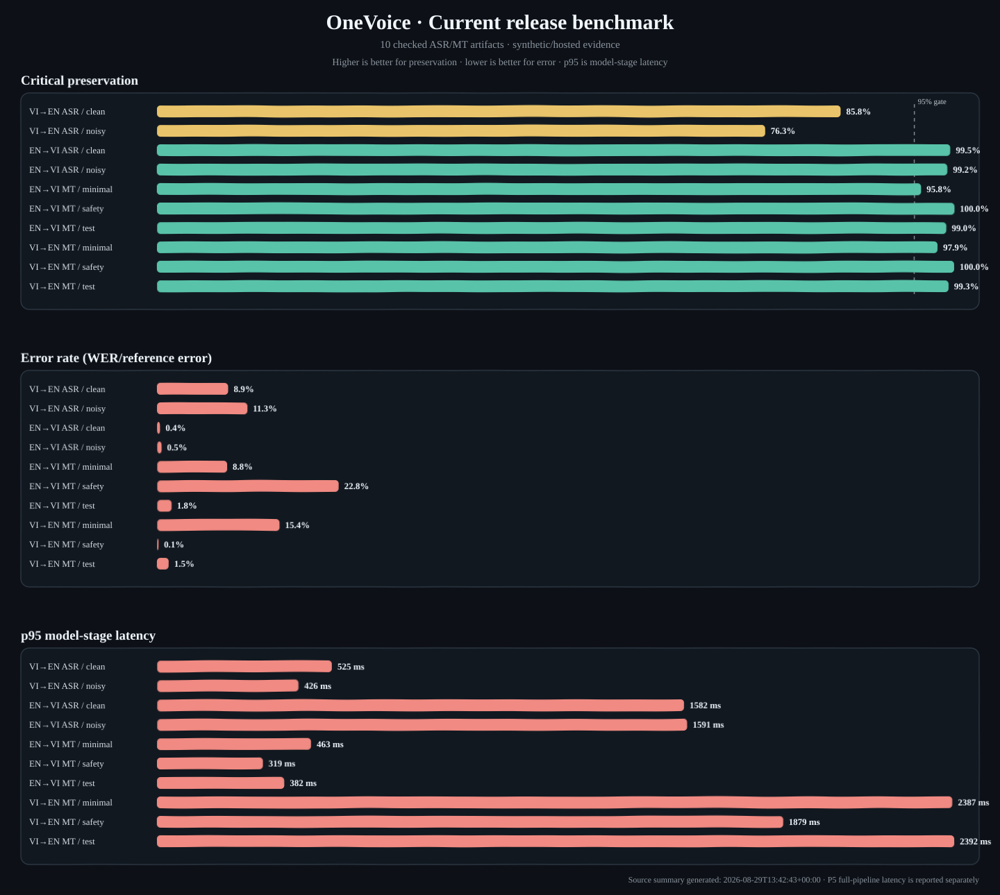

# OneVoice Edge V2

**Dịch giọng nói Việt ↔ Anh trên Windows PC, chạy offline.**

OneVoice là prototype dịch lời nói hai chiều cho hội thoại công nghiệp. Bản hiện tại dành cho demo có giám sát trên laptop Windows. Model, nhận diện, dịch và giọng đọc chạy từ môi trường và bundle đã chuẩn bị trên máy.

| | Tình trạng hiện tại |
|---|---|
| Runtime | Windows PC, profile edge, chạy offline sau khi chuẩn bị môi trường và hai bundle |
| VI → EN | GIPFormer ONNX baseline; ASR noisy chưa đạt mục tiêu recall thuật ngữ 95% |
| EN → VI | SenseVoice fine-tuned ONNX FP32 |
| Dịch | EnViT5 fine-tuned, kiểm tra nội dung và thuật ngữ |
| Đọc | Giọng hệ thống Windows offline; câu safety dùng WAV tổng hợp đã duyệt nội bộ |
| Giới hạn | Chưa nghiệm thu tại công trường; chưa triển khai Android, Snapdragon hoặc Bluetooth hai chiều |

## Pipeline

~~~mermaid
flowchart LR
    A[Microphone] --> B[Audio frames 32 ms và VAD]
    B --> C{Hướng dịch}
    C -->|VI → EN| D[GIPFormer ONNX]
    C -->|EN → VI| E[SenseVoice ONNX]
    D --> F[EnViT5 và Context/Safety]
    E --> F
    F --> G[Windows TTS hoặc safety WAV]
    G --> H[Loa / tai nghe]
~~~

Runtime có thể hiện bản ASR đang nhận và bản cuối câu trong terminal; việc dịch thông thường bắt đầu khi người nói ngừng khoảng 0,5 giây. Khi loa cùng laptop đang phát, tùy chọn half-duplex tạm ngưng gửi âm thanh micro vào ASR để hạn chế máy thu lại giọng đọc.

## Chạy live trên Windows

### Cần chuẩn bị một lần

- Windows với môi trường Conda onevoice và thư viện runtime đã cài.
- Hai bundle đã giải nén: vi2en và en2vi. Mỗi bundle gồm model cùng runtime_config.yaml.
- Repository này trên máy và microphone/loa đã được Windows nhận diện.

Nếu thiết lập trên máy mới, tạo môi trường và cài các gói dành cho edge một lần:

~~~powershell
$Repo = "D:\code\.vscode\OneVoice\onevoice-edge"
conda create -n onevoice python=3.11.8 -y
conda activate onevoice
python -m pip install -r "$Repo\requirements-edge.txt"
~~~

Nếu đã có môi trường Conda onevoice dùng được, kích hoạt môi trường đó và bỏ qua bước tạo/cài lại. Các lệnh chạy live bên dưới dùng đường dẫn Python của môi trường này.

Làm theo [hướng dẫn đóng gói và thiết lập Windows](docs/PC_DESKTOP_RELEASE.md) nếu cần tải, xác minh hoặc dựng lại bundle. Khi chạy offline, pipeline không tải model từ Hugging Face; các model phải có trong bundle trên máy.

### Mở PowerShell

Điền đúng đường dẫn repo và nơi đã giải nén bundle. Kích hoạt môi trường rồi thiết lập module nguồn:

~~~powershell
conda activate onevoice
$Repo = "D:\code\.vscode\OneVoice\onevoice-edge"
$OneVoicePython = "D:\MINICONDA\envs\onevoice\python.exe"
$env:PYTHONPATH = "$Repo\src"
$env:PYTHONIOENCODING = "utf-8"
~~~

### VI → EN: nói tiếng Việt, nghe tiếng Anh

~~~powershell
$Bundle = "D:\OneVoiceDesktop\onevoice-v2-rc1\vi2en"
$RunId = Get-Date -Format "yyyyMMdd-HHmmss"
$ReportDir = Join-Path "$Repo\reports\terminal-live" "vi2en-$RunId"
$LiveArgs = @(
    "-u", "$Repo\src\pipeline.py",
    "--config", ".\runtime_config.yaml",
    "--direction", "vi2en",
    "--profile", "edge", "--offline",
    "--input-device", "Microphone Array MME",
    "--output-device", "Speakers Realtek WASAPI",
    "--tts-backend", "sapi",
    "--windows-en-voice", "Microsoft Zira Desktop",
    "--windows-en-rate", "-2",
    "--pause-mic-during-playback",
    "--report-dir", $ReportDir
)
Set-Location $Bundle
& $OneVoicePython @LiveArgs
~~~

### EN → VI: nói tiếng Anh, nghe tiếng Việt

~~~powershell
$Bundle = "D:\OneVoiceDesktop\onevoice-v2-rc1\en2vi"
$RunId = Get-Date -Format "yyyyMMdd-HHmmss"
$ReportDir = Join-Path "$Repo\reports\terminal-live" "en2vi-$RunId"
$LiveArgs = @(
    "-u", "$Repo\src\pipeline.py",
    "--config", ".\runtime_config.yaml",
    "--direction", "en2vi",
    "--profile", "edge", "--offline",
    "--input-device", "Microphone Array MME",
    "--output-device", "Speakers Realtek WASAPI",
    "--tts-backend", "sapi",
    "--pause-mic-during-playback",
    "--report-dir", $ReportDir
)
Set-Location $Bundle
& $OneVoicePython @LiveArgs
~~~

Thay đường dẫn D: và tên microphone/loa nếu máy bạn dùng vị trí hoặc thiết bị khác. Xem thiết bị đang có bằng lệnh:

~~~powershell
& $OneVoicePython -m sounddevice
~~~

Đợi terminal báo pipeline đang nghe, nói một câu rồi ngắt nhẹ để dịch. Các dòng ASR cho biết model nhận dạng thế nào; bản cuối câu và dòng Translation cho biết nội dung được đem đi dịch và bản dịch thực tế. Đây là kết quả model trả về, không được soạn sẵn. Chờ phát xong rồi nói tiếp. Nhấn Ctrl+C để dừng; báo cáo của lượt chạy được ghi vào thư mục riêng dưới reports/terminal-live.

Tên giọng Windows phải có trên máy. EN → VI dùng giọng đọc tiếng Việt cài sẵn và cấu hình trong bundle. Cấu hình chọn ngưỡng microphone, giọng đọc và chế độ phát được giải thích thêm trong [hướng dẫn Windows](docs/PC_DESKTOP_RELEASE.md). Để xem ASR trong cửa sổ riêng, có script tùy chọn [run_desktop_live.py](scripts/run_desktop_live.py).

## Benchmark pipeline PC

Bản full benchmark gần nhất trong repository được ghi ngày 29/09/2026. Nó phát lại corpus WAV trên ASUS TUF Gaming F15 (i5-11400H, RAM 24 GB, RTX 2050 4 GB), Windows offline; đây không phải phép đo qua micro hoặc loa vật lý. Benchmark dùng runtime da7f34e; các thay đổi cửa sổ live và quan sát terminal được thêm sau mốc đó.

| Chỉ số | Baseline 28/09 | Bản đo 29/09 |
|---|---:|---:|
| Lượt qua gate chức năng | 4.573/4.756 (96,15%) | 4.674/4.756 (98,28%) |
| WER ASR VI → EN trên noisy | 11,81% | 11,32% |
| WER ASR EN → VI trên noisy | 1,21% | 0,55% |
| WER bản dịch VI → EN trên noisy | 16,33% | 13,79% |
| WER bản dịch EN → VI trên noisy | 4,90% | 4,17% |
| Safety qua gate | 174/252 | 208/252 |
| Commit → audio đầu tiên, p95 VI → EN | 1.391 ms | 1.211 ms |
| Commit → audio đầu tiên, p95 EN → VI | 804 ms | 1.018 ms |

Các lượt thử gồm 4.504 WAV noisy và 252 WAV safety tổng hợp. Gate kiểm tra điều kiện thực thi của pipeline; PASS không đồng nghĩa bản dịch chính xác về nghĩa. Có 44 lượt safety không qua gate và 582 lượt qua gate bị rule đối chiếu reference gắn cờ cần review. WER so sánh văn bản với reference, không phải phần trăm câu đúng. Latency đo lúc audio được tạo trong buffer, không đo thời điểm người nghe nhận được tiếng.

**Đánh giá:** bản đo mới cải thiện tổng số qua gate, WER và latency VI → EN; latency EN → VI tăng. Kết quả đủ mô tả một prototype PC offline có giám sát, chưa đủ để tuyên bố vận hành an toàn hoặc đã được xác nhận ở công trường.

### Báo cáo và biểu đồ

- [So sánh full benchmark 29/09](docs/desktop_runtime_rebenchmark_2026-09-29/report.md) · [JSON](docs/desktop_runtime_rebenchmark_2026-09-29/summary.json) · [Biểu đồ](docs/desktop_runtime_rebenchmark_2026-09-29/overview.svg)
- [Benchmark full 28/09](docs/desktop_runtime_rebenchmark/report.md) · [HTML](docs/desktop_runtime_rebenchmark/report.html) · [JSON](docs/desktop_runtime_rebenchmark/summary.json)
- [Benchmark thành phần ASR/MT, 29/08](report.md) · [HTML](report.html) · [JSON](summary.json)
- [Biểu đồ benchmark thành phần](docs/benchmark_release_overview.svg)
- [Ví dụ dịch V1 và các bản thu](docs/LEGACY_DEMOS_V1.md)

Các phiên streaming fixed suite và soak trên Colab được mô tả trong [Colab runbook](docs/COLAB_RUNBOOK.md). Các notebook V2 nằm trong thư mục [notebooks](notebooks/).

## Giới hạn và bước tiếp theo

- Bộ test có âm thanh tổng hợp và biến thể nhiễu; số WAV không tương ứng số người nói độc lập. Chưa có đánh giá holdout tại công trường.
- VI → EN ASR còn là hạn chế chính; các model GIPFormer fine-tune thử nghiệm trước đó không qua gate, nên bản đang dùng là baseline ONNX.
- Safety WAV hỗ trợ demo nội bộ, chưa phải bằng chứng lựa chọn đúng cảnh báo trong vận hành thật.
- Profile portable edge_200mb chưa đạt giới hạn bộ nhớ đó. Số đo trên laptop không áp dụng tự động cho thiết bị khác.
- Android, tăng tốc Snapdragon và định tuyến tai nghe cho hai người là roadmap.

Xem [kế hoạch Android/Snapdragon](docs/ANDROID_SNAPDRAGON_EXECUTION.md) và [kế hoạch V1 sang V2](ONEVOICE_V1_TO_V2_PLAN.md).

## Giấy phép

Repository khai báo CC BY-NC 4.0. Model và thành phần bên thứ ba có điều khoản riêng; xem [LICENSE](LICENSE) trước khi phân phối hoặc sử dụng.
