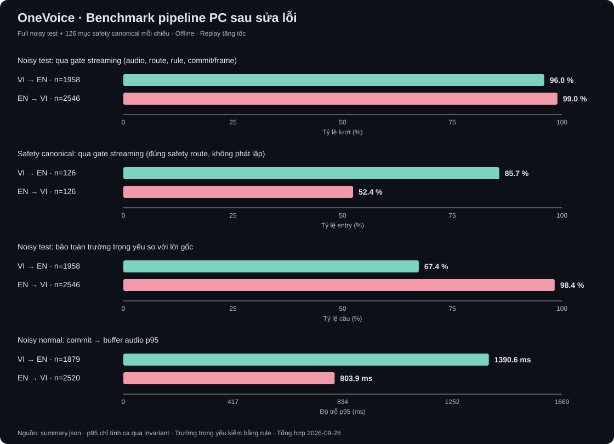

# OneVoice — benchmark PC sau sửa lỗi

PC Windows offline, replay tăng tốc WAV tổng hợp và TTS hệ thống cục bộ. Thời gian tạo buffer audio không gồm driver hoặc truyền Bluetooth. Trường trọng yếu được đối chiếu với văn bản gốc bằng rule; chưa phải đánh giá ngữ nghĩa của người nghe.

Đã hoàn tất 4,756 lượt streaming; còn 183 lượt không qua gate chức năng. Hoàn tất phép đo không có nghĩa đã đạt nghiệm thu sản phẩm.

## VI → EN

Runtime commit `a34118afeaad4124f59c5f95ca567f7040dd905f`; policy `endpoint`; giọng `windows-sapi-offline` (Microsoft David Desktop).
Đã đo 2084/2084 lượt: 1987 qua invariant chức năng, 97 lỗi. RAM process Python peak 2.78 GiB; không gồm process con (PowerShell SAPI/eSpeak).

### test_noisy · 1958 mẫu

- Corpus: 1958 entry, 1958 hash WAV riêng, 979 văn bản nguồn riêng. Entry không đồng nghĩa câu/người nói độc lập.
- Qua invariant: 1879/1958; output trống: 39.
- WER/CER hypothesis ASR endpoint đã chuẩn hóa: 11.81% / 8.27%.
- Bảo toàn trường trọng yếu theo reference: 67.36%.
- WER văn bản dịch so với reference: 16.33%; exact match: 56.23%.
- Commit→audio p50/p95: 971.6 ms / 1,390.6 ms.

### approved_safety · 126 mẫu

- Corpus: 126 entry, 126 hash WAV riêng, 126 văn bản nguồn riêng. Entry không đồng nghĩa câu/người nói độc lập.
- Qua invariant: 108/126; output trống: 2.
- WER/CER hypothesis ASR endpoint đã chuẩn hóa: 5.73% / 3.74%.
- Bảo toàn trường trọng yếu theo reference: 91.27%.
- WER văn bản dịch so với reference: 11.02%; exact match: 86.51%.
- Commit→audio p50/p95: 2.8 ms / 4.0 ms.

TTS đúng ngôn ngữ đầu ra (en): 979/979 câu; p50/p95 392.4 ms / 427.3 ms.
P5 input cố định, 5 lượt mỗi route: gate budget PASS; blockers: [].

Các lỗi chức năng đầu tiên (danh sách đầy đủ trong summary.json):

- `vi2en-test-noisy-00167`: RuntimeError: Streaming latency report is empty
- `vi2en-test-noisy-00168`: RuntimeError: Streaming latency report is empty
- `vi2en-test-noisy-00257`: RuntimeError: Translation critical-field validator rejected this stream turn
- `vi2en-test-noisy-00258`: RuntimeError: Translation critical-field validator rejected this stream turn
- `vi2en-test-noisy-00274`: RuntimeError: Streaming latency report is empty
- `vi2en-test-noisy-00315`: RuntimeError: Translation critical-field validator rejected this stream turn
- `vi2en-test-noisy-00316`: RuntimeError: Translation critical-field validator rejected this stream turn
- `vi2en-test-noisy-00342`: RuntimeError: Streaming latency report is empty
- `vi2en-test-noisy-00358`: RuntimeError: Translation critical-field validator rejected this stream turn
- `vi2en-test-noisy-00381`: RuntimeError: Streaming latency report is empty

Lượt qua invariant nhưng không qua rule reference: 560.
Nhóm lỗi chức năng: {'RuntimeError: Streaming latency report is empty': 41, 'RuntimeError: Translation critical-field validator rejected this stream turn': 39, 'RuntimeError: Safety stream must create exactly one safety commit': 16, 'RuntimeError: Normal stream did not produce a normal semantic commit': 1}.
Số lần rule reference báo thiếu: {'missing_term': 536, 'missing_number': 154, 'missing_unit': 34, 'missing_negation': 21, 'missing_direction': 8} (một câu có thể có nhiều lỗi).

Khớp nguyên safety ID theo reference: 107/126. Đây là kiểm tra ID, không phải độ chính xác nghĩa; các biến thể tương đương cần review. Chi tiết nằm trong `diagnostics.safety_review` của summary.json.

## EN → VI

Runtime commit `a34118afeaad4124f59c5f95ca567f7040dd905f`; policy `endpoint`; giọng `espeak-ng-offline-demo` (giọng VI local).
Đã đo 2672/2672 lượt: 2586 qua invariant chức năng, 86 lỗi. RAM process Python peak 3.50 GiB; không gồm process con (PowerShell SAPI/eSpeak).

### test_noisy · 2546 mẫu

- Corpus: 2546 entry, 2546 hash WAV riêng, 1135 văn bản nguồn riêng. Entry không đồng nghĩa câu/người nói độc lập.
- Qua invariant: 2520/2546; output trống: 14.
- WER/CER hypothesis ASR endpoint đã chuẩn hóa: 1.21% / 1.10%.
- Bảo toàn trường trọng yếu theo reference: 98.35%.
- WER văn bản dịch so với reference: 4.90%; exact match: 76.63%.
- Commit→audio p50/p95: 550.3 ms / 803.9 ms.

### approved_safety · 126 mẫu

- Corpus: 126 entry, 78 hash WAV riêng, 33 văn bản nguồn riêng. Entry không đồng nghĩa câu/người nói độc lập.
- Qua invariant: 66/126; output trống: 0.
- WER/CER hypothesis ASR endpoint đã chuẩn hóa: 14.76% / 9.83%.
- Bảo toàn trường trọng yếu theo reference: 100.00%.
- WER văn bản dịch so với reference: 47.57%; exact match: 14.29%.
- Commit→audio p50/p95: 2.5 ms / 3.6 ms.

Lưu ý: 100% qua rule reference nhưng 60 lượt không qua safety gate. Rule chưa bao phủ đủ nghĩa cảnh báo; con số 100% này không phải độ chính xác safety.

TTS đúng ngôn ngữ đầu ra (vi): 976/979 câu; p50/p95 74.1 ms / 91.9 ms.
P5 input cố định, 5 lượt mỗi route: gate budget PASS; blockers: [].

Các lỗi chức năng đầu tiên (danh sách đầy đủ trong summary.json):

- `en2vi-test-noisy-00297`: RuntimeError: Translation critical-field validator rejected this stream turn
- `en2vi-test-noisy-00298`: RuntimeError: Translation critical-field validator rejected this stream turn
- `en2vi-test-noisy-00541`: RuntimeError: Translation critical-field validator rejected this stream turn
- `en2vi-test-noisy-00542`: RuntimeError: Translation critical-field validator rejected this stream turn
- `en2vi-test-noisy-00661`: RuntimeError: Translation critical-field validator rejected this stream turn
- `en2vi-test-noisy-00662`: RuntimeError: Translation critical-field validator rejected this stream turn
- `en2vi-test-noisy-00729`: RuntimeError: Streaming latency report is empty
- `en2vi-test-noisy-00730`: RuntimeError: Streaming latency report is empty
- `en2vi-test-noisy-01105`: RuntimeError: Translation critical-field validator rejected this stream turn
- `en2vi-test-noisy-01106`: RuntimeError: Translation critical-field validator rejected this stream turn

Lượt qua invariant nhưng không qua rule reference: 16.
Nhóm lỗi chức năng: {'RuntimeError: Safety stream must create exactly one safety commit': 60, 'RuntimeError: Streaming latency report is empty': 14, 'RuntimeError: Translation critical-field validator rejected this stream turn': 12}.
Số lần rule reference báo thiếu: {'missing_term': 52, 'missing_number': 4} (một câu có thể có nhiều lỗi).

Khớp nguyên safety ID theo reference: 17/126. Đây là kiểm tra ID, không phải độ chính xác nghĩa; các biến thể tương đương cần review. Chi tiết nằm trong `diagnostics.safety_review` của summary.json.

## Diễn giải

Qua invariant nghĩa là có audio hợp lệ, đúng route, không rơi/đảo frame/commit và không có cảnh báo validator runtime theo ASR. Không đồng nghĩa nội dung dịch đúng hoàn toàn so với lời gốc.
p50/p95 pipeline chỉ tính ca qua invariant chức năng. Ca đã tạo audio nhưng bị rule/route đánh FAIL không góp latency vào các percentile này; số lượng pass/fail được công bố riêng.
Ca lỗi vẫn nằm trong mẫu số chất lượng. Nếu một ca lỗi đã có bản dịch/audio, phép đo giữ văn bản thực tế; chỉ ca không có output mới dùng chuỗi rỗng, không loại ca khó ra khỏi báo cáo.
WER văn bản dịch đo khác biệt bề mặt với một reference. Cách diễn đạt khác có thể vẫn đúng nghĩa; không dùng 1 − WER làm độ chính xác dịch.
Bảo toàn trường trọng yếu dùng validator thuật ngữ/entity/phủ định so với lời gốc. Đây là phép kiểm tự động, chưa thay thế người nghe hoặc đánh giá ngữ nghĩa.
Chỉ số này là tỷ lệ câu qua toàn bộ rule phát hiện được, không phải critical-term recall theo số thuật ngữ của benchmark ASR. Câu không có trường được rule phát hiện vẫn có thể qua kiểm tra dù sai nghĩa; không so trực tiếp hai metric hoặc gọi chúng là độ chính xác dịch.
Rule hiện tại có thể báo nhầm khi dùng từ tương đương hoặc viết số thành chữ, chẳng hạn material store thay material storage area, hoặc five hundred thay 500. Không diễn giải mọi cảnh báo thành lỗi model; ví dụ raw được giữ trong summary.json để review.
Gate safety kiểm tra đường audio đã duyệt, chưa đủ chứng minh chọn đúng mệnh lệnh. summary.json bổ sung mức khớp safety ID và ví dụ để review; ID khác có thể là câu tương đương, không tự kết luận sai nghĩa.
Latency ASR trong ledger là lần ASR tạo commit, không phải tổng mọi lần suy luận trên rolling window. Commit→audio và toàn lượt mới mô tả phần pipeline được đo.
Load time là lần nạp model quan sát được trong mỗi process, không phải kiểm tra cold boot/cache trống. Peak RSS là của Python, không phải tổng RAM của máy hoặc toàn bộ process con.
WER/CER ASR ở báo cáo này lấy hypothesis endpoint sau normalize/rolling assembly của runtime, không phải raw ASR benchmark đơn lẻ. Không dùng chênh lệch này để kết luận model/ONNX bị giảm độ chính xác.
Full ở đây là full noisy test local và toàn bộ safety canonical. Full clean corpus, mic live, độ rõ của giọng, tai nghe Bluetooth và WAV công trường chưa được nghiệm thu bởi lượt này.

Mỗi mẫu noisy là một WAV/biến thể nhiễu, không phải một người nói độc lập. VI và EN dùng hai manifest có kích thước/split riêng; không so tỷ lệ hai chiều như thể chúng được đo trên cùng một tập câu.
