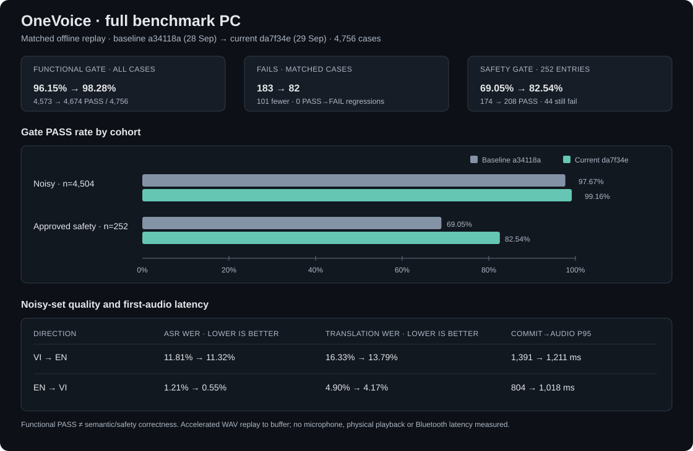

# OneVoice — full benchmark pipeline PC, 29/09/2026

## Tóm tắt

Full runtime `da7f34e` được so sánh theo từng case với full baseline
`a34118a`. Cùng 4.756 lượt, kết quả gate chức năng tăng từ 4.573/4.756
(96,15%) lên 4.674/4.756 (98,28%): giảm 101 lượt FAIL và không có lượt
PASS cũ chuyển thành FAIL trong đối chiếu pass/fail.

Kết quả này tốt hơn baseline full trước đó trên gate và các chỉ số văn bản
được báo cáo, nhưng chưa đủ để kết luận an toàn production. Còn 44/252 ca
safety fail runtime gate; đồng thời 582 ca qua gate chức năng bị rule so với
reference gắn cờ cần review. Có lỗi nghĩa thực sự trong một số kết quả PASS.

## Phạm vi và cách so sánh

- Windows PC, profile `edge`, offline; network của tiến trình Python bị chặn.
- Replay WAV tăng tốc qua ASR → MT/context/safety → TTS; không thu mic hay phát
  ra tai nghe vật lý trong phép đo này.
- VI→EN dùng Windows SAPI offline (Microsoft David Desktop); EN→VI dùng
  eSpeak NG offline demo voice. Cùng backend tương ứng được giữ giữa baseline
  và bản hiện tại.
- VI→EN gồm 1.958 noisy + 126 safety; EN→VI gồm 2.546 noisy + 126 safety.
  Tổng 4.756 lượt. Safety WAV là dữ liệu synthetic/được duyệt nội bộ.
- Case ID, hash audio, reference, suite, model/artifact, cấu hình, platform,
  Python, dependencies và chế độ replay đã được đối chiếu khớp.
- Revision hiện tại: `da7f34eb8d1c741b7d05a059db74ae83c57fab56`; baseline:
  `a34118afeaad4124f59c5f95ca567f7040dd905f`.

## Gate chức năng

| Tập | Baseline `a34118a` | Hiện tại `da7f34e` |
|---|---:|---:|
| Tất cả | 4.573/4.756 (96,15%) | 4.674/4.756 (98,28%) |
| Noisy | 4.399/4.504 (97,67%) | 4.466/4.504 (99,16%) |
| Safety | 174/252 (69,05%) | 208/252 (82,54%) |
| VI→EN | 1.987/2.084 | 2.049/2.084 |
| EN→VI | 2.586/2.672 | 2.625/2.672 |

Đối chiếu từng lượt cho thấy 62 case VI→EN và 39 case EN→VI đổi từ FAIL sang
PASS; không có regression ở trạng thái pass/fail. Các tập kiểm thử là nhiều
biến thể WAV của một số câu nguồn, không phải số người nói độc lập.

## Chất lượng văn bản và latency noisy

WER/CER thấp hơn là tốt hơn. Translation WER so sánh bản dịch với reference,
không phải tỷ lệ câu dịch đúng. `commit→audio p95` là thời gian từ khi chốt
đoạn đến audio đầu tiên trong buffer, chỉ tính lượt noisy qua gate.

| Hướng | ASR WER | ASR CER | Translation WER | Exact match bản dịch | Commit→audio p95 |
|---|---:|---:|---:|---:|---:|
| VI→EN baseline → hiện tại | 11,81% → 11,32% | 8,27% → 7,80% | 16,33% → 13,79% | 56,23% → 57,87% | 1.391 → 1.211 ms |
| EN→VI baseline → hiện tại | 1,21% → 0,55% | 1,10% → 0,26% | 4,90% → 4,17% | 76,63% → 80,56% | 804 → 1.018 ms |

EN→VI có p95 commit→audio chậm hơn khoảng 214 ms, dù các chỉ số văn bản và
gate tăng. VI→EN vừa cải thiện chỉ số văn bản/gate vừa giảm p95 khoảng
179 ms. Latency này không bao gồm người nói, driver phát, loa hoặc Bluetooth.

## Safety và diễn giải

- Safety runtime gate tăng từ 174/252 lên 208/252; bản hiện tại vẫn còn 44
  entry fail (12 VI→EN, 32 EN→VI).
- 582 output qua gate chức năng bị rule reference riêng gắn cờ (564 VI→EN,
  18 EN→VI). Đây là danh sách cần review; không đồng nghĩa toàn bộ đều sai,
  nhưng không được gộp với gate PASS thành tuyên bố chính xác.
- Gate runtime kiểm tra invariant như route, commit và đầu ra; nó không chứng
  minh mọi câu bảo toàn nghĩa. Đã có ví dụ output PASS nhưng sai động tác hoặc
  còn lẫn ngôn ngữ.
- Full test corpus này được dùng trong chu trình sửa lỗi; kết quả không thay
  thế đánh giá trên holdout mới, ghi âm thực địa, người nghe hay đánh giá
  chuyên gia an toàn.

## Kết luận sử dụng

`da7f34e` là mốc full benchmark PC tốt hơn `a34118a` trên cùng corpus và là
ứng viên hiện tại để demo có giám sát. Không nên gọi đây là production safety
certification hoặc bằng chứng hiệu năng trên điện thoại/tai nghe Bluetooth.

Số liệu tổng hợp không chứa transcript từng case. Dữ liệu nguồn chi tiết vẫn
ở báo cáo cục bộ và không được đưa vào repo công khai.
